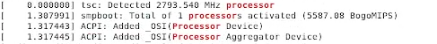
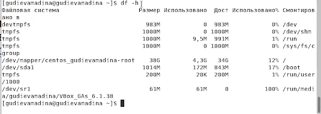

**Лабораторная работа №1**

**Установка и конфигурация операционной системы на виртуальную машину**

Гудиева Мадина Куйраевна
#

# **Цель работы**
Приобретение практических навыков установки операционной системы на виртуальную машину, настройки минимально необходимых для дальнейшей работы сервисов.
# **Выполнение лабораторной работы**

1. Я создала новую виртуальную машину, указав имя виртуальной машины - Info-sec, тип операционной системы - Linux, RedHat, размер основной памяти виртуальной машины - 2048. Помимо этого я задала размер диска - 40 ГБ, проверила, что конфигурация жесткого диска - загрузочный, VDI, динамический виртуальный диск 

2. После того, как виртуальная машина  появилась в окне менеджера VirtualBox, я перешла в её настройки, где добавила новый привод оптических дисков и выбрала образ CentOS-7-x86\_64-DVD-2009.iso.

3. Я запустила виртуальную машину и выбрала установку системы на жёсткий диск, установила язык для интерфейса.

5. В качестве имени узла сети указала gudievamadina.localdomain 

6. Выбрала для установки сервер с GUI и средства разработки 

7. Проверив остальные данные на корректность и отключив KDUMP, я начала установку. В ходе установки я задала пароль root  и пользователя gudievamadina согласно соглашению об именовании.

7. Получила следующую информацию. 

1. Версию ядра Linux (Linux version). 

2. Частоту процессора (Detected Mhz processor). 

3. Модель процессора (CPU0). 

4. Объем доступной оперативной памяти (Memory available). 

5. Тип обнаруженного гипервизора (Hypervisor detected). 

6. Тип файловой системы корневого раздела.20 Кулябов Д. С., Королькова А. В., Геворкян М. Н. 

7. Последовательность монтирования файловых систем

# **Выводы**
Таким образом я успешно приобрела практические навыки установки операционной системы на виртуальную машину и настройки минимально необходимых для дальнейшей работы сервисов.

Контрольные вопросы
1. Какую информацию содержит учётная запись пользователя? 

Учётная запись, как правило, содержит сведения, необходимые для опознания пользователя при подключении к системе, сведения для авторизации и учёта. Это идентификатор пользователя (login) и его пароль.

2. Укажите команды терминала и приведите примеры: 

– для получения справки по команде; 
Команда Help - сведения об определенной команде

– для перемещения по файловой системе; 

Для перемещения и переименования файлов и каталогов применяется команда mv

– для просмотра содержимого каталога; 

Для просмотра содержимого каталога используется команда ls.

– для определения объёма каталога; 

Команда Df

– для создания / удаления каталогов / файлов; 
touch - создание файла rm - удаление файла

– для задания определённых прав на файл / каталог; 

С помощью команды chmod изменяют права доступа к файлам и каталогам.

– для просмотра истории команд. 

history

3. Что такое файловая система? Приведите примеры с краткой характери- 

стикой. 

Фа́йловая систе́ма — порядок, определяющий способ организации, хранения и именования данных на носителях информации в компьютерах, а также в другом электронном оборудовании: цифровых фотоаппаратах, мобильных телефонах и т. п.
FAT (таблица распределения файлов)

NTFS (файловая система новой технологии)

ReFS (Resilient File System)

4. Как посмотреть, какие файловые системы подмонтированы в ОС? 

Для того чтобы узнать какие файловые системы смонтированы, нужно дать команду mount без параметров

5. Как удалить зависший процесс? 

Когда известен PID процесса, мы можем убить его командой kill.
