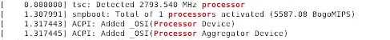
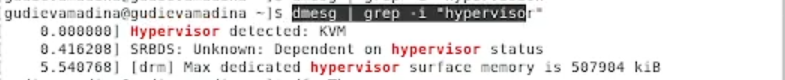
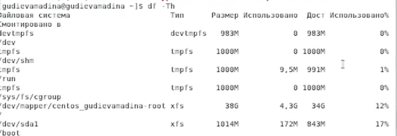
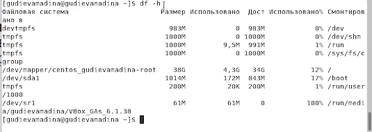



# Лабораторная работа №1

## Установк а и конфигурация операционной системы на виртуальную машину

### Гудиева Мадина Куйраевна

#### Цель работы

##### Приобретение практических навыков установки операционной системы на виртуальную машину, настройки минимально необходимых для дальнейшей работы сервисов.

Я создала новую виртуальную машину, указав имя виртуальной машины - Info-sec, тип
операционной системы - Linux, RedHat, размер основной памяти виртуальной машины
 2048. Помимо этого я задала размер диска - 40 ГБ, проверила, что конфигурация
жесткого диска - загрузочный, VDI, динамический виртуальный диск

• После того, как виртуальная машина появилась в окне менеджера VirtualBox, я перешла в её настройки, где добавила новый привод оптических дисков и выбрала образ CentOS-7- x86\_64-DVD-2009.iso.

• Я запустила виртуальную машину и выбрала установку системы на жёсткий диск, установила язык для интерфейса.

• В качестве имени узла сети указала gudievamadina.localdomain

• Выбрала для установки сервер с GUI и средства разработки

• Проверив остальные данные на корректность и отключив KDUMP, я начала установку. В ходе установки я задала пароль root и пользователя gudievamadina согласно соглашению об именовании.

• Получила следующую информацию.

• 1. Версию ядра Linux (Linux version).

• 2. Частоту процессора (Detected Mhz

processor).

• 3. Модель процессора (CPU0).

• 4. Объем доступной оперативной памяти

(Memory available).

• 5. Тип обнаруженного гипервизора (Hypervisor

detected).

• 6. Тип файловой системы корневого

раздела.

• 7. Последовательность монтирования

файловых систем

