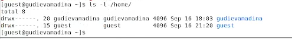
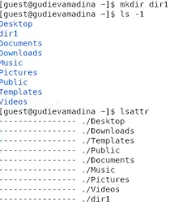
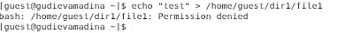

**Лабораторная работа №2**

**Дискреционное разграничение прав в Linux. Основные атрибуты**

Гудиева Мадина Куйраевна

Содержание

**Цель работы**

Получение практических навыков работы в консоли с атрибутами файлов, закрепление теоретических основ дискреционного разграничения доступа в современных системах с открытым кодом на базе ОС Linux.

**Теоретические сведения**

В Linux, как и в любой многопользовательской системе, абсолютно естественным образом возникает задача разграничения доступа субъектов — пользователей к объектам — файлам дерева каталогов.

Один из подходов к разграничению доступа — так называемый дискреционный (от англ, discretion — чье-либо усмотрение) — предполагает назначение владельцев объектов, которые по собственному усмотрению определяют права доступа субъектов (других пользователей) к объектам (файлам), которыми владеют.

Дискреционные механизмы разграничения доступа используются для разграничения прав доступа процессов как обычных пользователей, так и для ограничения прав системных программ в (например, служб операционной системы), которые работают от лица псевдопользовательских учетных записей. [1]

Для каждого файла в Linux задается набор разрешений. Разрешения могут быть следующими:

- r — read — возможность открытия и чтения файла. Для директории это возможность просматривать содержимое директории.
- w — write — возможность изменения файла. Для директории это возможность добавлять, удалять или переименовывать файлы в директории.
- x — execute — возможность выполнения файла (запуска файла). [2]

Набор разрешений состоит из 3 блоков rwx:

- Первый блок rwx определяет права доступа для владельца-пользователя.
- Второй блок rwx определяет права доступа для владельца-группы.
- Третий блок rwx определяет права доступа для всех остальных. [2]

Для каждого файла или директории в Linux задаются права доступа. Они задаются тремя атрибутами: набором разрешений, именем владельца, именем группы.

Набор разрешений — это три блока прав доступа: права доступа для владельца файла, права доступа для группы, права доступа для всех остальных.

Разрешения записываются символами r, w, x.

Набор разрешений состоит из трех блоков и записывается в виде трех rwx, записанных друг за другом в виде одного «слова».

Если какая-либо возможность отключена (запрещена), то вместо соответствующего символа в наборе разрешений ставится прочерк (символ минус).

**Выполнение лабораторной работы**

1. В установленной при выполнении предыдущей лабораторной работы операционной системе создала учётную запись пользователя guest, а также задала для этого пользователя пароль.

 

2. Вошла в систему от имени пользователя guest.

3. Определите директорию, в которой я нахожусь, командой pwd. С помощью этой команды я убедилась, что нахожусь в домашней директории пользователя.

4. Уточнила имя пользователя командой whoami 

5. Уточнила имя пользователя, его группу, а также группы, куда входит пользователь, командой id. Затем воспользовалась командой groups, которая дополнительно обозначила домашнюю директорию.

 

6. Просмотрела файл ‘/etc/passwd’ командой cat ‘/etc/passwd’. Нашла в нём свою учётную запись, где увидела выведенные ранее значения uid, gid .
 

 

7. Определила существующие в системе директории. Увидела директории моих пользователей, в них пользователь имеет права на чтение, запись и исполнение файлов .

 

8. Просмотрела, какие расширенные атрибуты установлены на поддиректориях, находящихся в директории ‘/home’. Увидела, что расширенных атрибутов на поддиректориях моего пользователя нет. Второго пользователя просмотреть не могу .

 
 

9. Создала в домашней директории поддиректорию dir1. Определила, что она получила права 775, а также не получила расширенных атрибутов.
 
 

10. Сняла с директории dir1 все атрибуты и проверила это.
 

11. Попыталась создать в директории dir1 файл file1, т.к. прав на создание файла у меня не было, я получила отказ.
 

12. Заполнила таблицу «Установленные права и разрешённые действия». Для этого я создала в директории 8 файлов с разными правами на каждом. После этого я меняла права dir1 и пробовала взаимодействовать с каждым из этих файлов, также пыталась зайти внутрь папки. Таким образом я проделала необходимые действия с каждым вариантов прав директории и прав файла .

13. На основе полученной информации из таблицы прошлого пункта, я смогла определить те или иные минимально необходимые права для выполнения операций внутри директории dir1. Так как в предыдущем пунте не требовалось создавать подкаталог, я дополнительно попробовала создать dir2 внутри dir1 (меняя права dir1) и удалить её.

**Выводы**

Таким образом я успешно приобрела практические навыки работы в консоли с атрибутами файлов, закрепила теоретические основы дискреционного разграничения доступа в современных системах с открытым кодом на базе ОС Linux.

**Список литературы**

1. Дискреционное разграничение доступа Linux. // Debianinstall. 2018. URL: https://debianinstall.ru/diskretsionnoe-razgranichenie-dostupa-linux/ (дата обращения 02.10.2021).
1. Права доступа к файлам в Linux. // Pingvinus. 2018.URL: https://pingvinus.ru/note/file-permissions (дата обращения 02.10.2021).
1. Д. С. Кулябов, А. В. Королькова, М. Н. Геворкян. Информационная безопасность компьютерных сетей: лабораторные работы. // Факультет физико-математических и естественных наук. M.: РУДН, 2015. 64 с..
