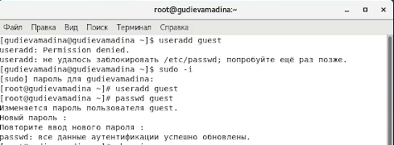
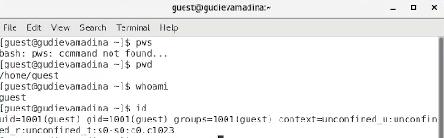
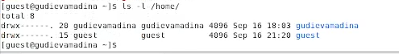
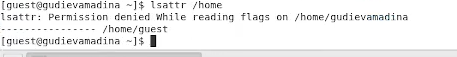
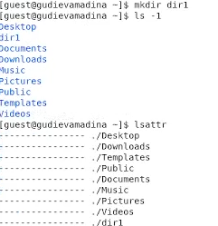
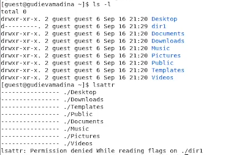
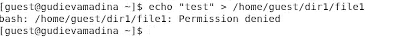
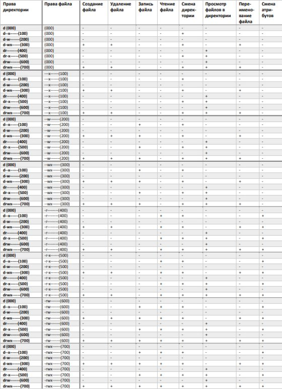

---
marp: true
---

# Лабораторная работа №2

## Дискреционное разграничение прав в Linux. Основные атрибуты

#### Гудиева Мадина Куйраевна

---

### Цель работы
Получение практических навыков работы в консоли с атрибутами файлов, закрепление теоретических основ дискреционного разграничения доступа в современных системах с открытым кодом на базе ОС Linux.

---

### Выполнение

1. Выполнение лабораторной работы
1. Оформление отчета и презентации
1. Выгрузка видео на youtube и файлов на GitHub

---

#### Создание учетной записи пользователя guest

---

#### Просмотр информации с нового пользователя

---

#### Просмотр существующих в системе директорий

---

#### Создание dir1

---

#### Смена прав dir1

---

#### Создание файла в dir1

#### Заполнение таблицы

---

#### Выводы

Таким образом я успешно приобрела практические навыки работы в консоли с атрибутами файлов, закрепила теоретические основы дискреционного разграничения доступа в современных системах с открытым кодом на базе ОС Linux.

