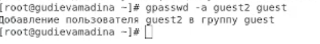
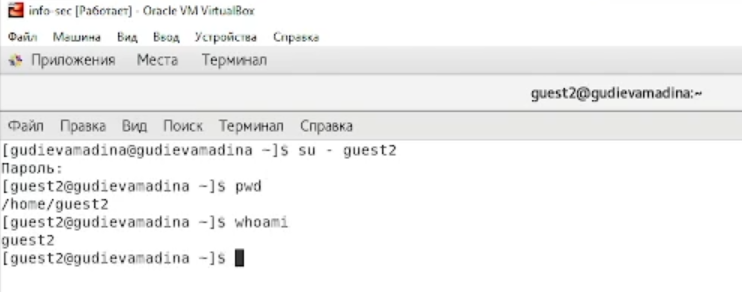
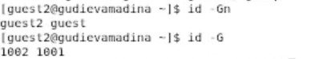
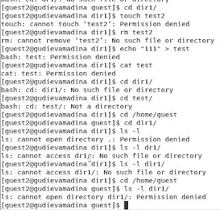

**Лабораторная работа №3**

**Дискреционное разграничение прав в Linux. Два пользователя**

Гудиева Мадина Куйраевна

Содержание

**Цель работы**

Получение практических навыков работы в консоли с атрибутами файлов для групп пользователей.

**Теоретические сведения**

В Linux, как и в любой многопользовательской системе, абсолютно естественным образом возникает задача разграничения доступа субъектов — пользователей к объектам — файлам дерева каталогов.

Один из подходов к разграничению доступа — так называемый дискреционный (от англ, discretion — чье-либо усмотрение) — предполагает назначение владельцев объектов, которые по собственному усмотрению определяют права доступа субъектов (других пользователей) к объектам (файлам), которыми владеют.

Дискреционные механизмы разграничения доступа используются для разграничения прав доступа процессов как обычных пользователей, так и для ограничения прав системных программ в (например, служб операционной системы), которые работают от лица псевдопользовательских учетных записей. [1]

Для каждого файла в Linux задается набор разрешений. Разрешения могут быть следующими:

- r — read — возможность открытия и чтения файла. Для директории это возможность просматривать содержимое директории.
- w — write — возможность изменения файла. Для директории это возможность добавлять, удалять или переименовывать файлы в директории.
- x — execute — возможность выполнения файла (запуска файла). [2]

Набор разрешений состоит из 3 блоков rwx:

- Первый блок rwx определяет права доступа для владельца-пользователя.
- Второй блок rwx определяет права доступа для владельца-группы.
- Третий блок rwx определяет права доступа для всех остальных. [2]

Для каждого файла или директории в Linux задаются права доступа. Они задаются тремя атрибутами: набором разрешений, именем владельца, именем группы.

Набор разрешений — это три блока прав доступа: права доступа для владельца файла, права доступа для группы, права доступа для всех остальных.

Разрешения записываются символами r, w, x.

Набор разрешений состоит из трех блоков и записывается в виде трех rwx, записанных друг за другом в виде одного «слова».

Если какая-либо возможность отключена (запрещена), то вместо соответствующего символа в наборе разрешений ставится прочерк (символ минус). [2]

**Выполнение лабораторной работы**

1. В установленной при выполнении предыдущей лабораторной работы операционной системе вошла в учётную запись пользователя guest и создала пользователя guest2, а также задала ему пароль (fig. 1).

*Figure 1: Создание учетной записи пользователя guest2*

2. Добавила пользователя guest2 в группу guest (fig. 2).

*Figure 2: Добавление пользователя guest2 в группу guest*

3. Осуществила вход в систему от двух пользователей на двух разных консолях: guest на первой консоли и guest2 на второй консоли.

4. Для обоих пользователей командой pwd определила директорию, в которой я нахожусь. Убедилась в том, что в командной строке отображается тоже самое. Также проверила имя пользователя и основную информацию (fig. 3).

*Figure 4: Использование команды whoami, id и pwd*

5. Определила командами ‘groups guest’ и ‘groups guest2’, в какие группы входят пользователи guest и guest2. Команды ‘id -Gn’ и ‘id -G’ показали id групп и их именования для пользователя, на котором я нахожусь. Информация оказалась аналогичной той, что вывелась после команды ‘groups’ (fig. 5).

*Figure 5: Уточнение группы пользователя, и тех, кто также входит в эту группу*

6. Просмотрела файл ‘/etc/group’, он показал аналогичную информацию (fig. 6).

*Figure 6: Просмотр файла ‘/etc/group’*

7. От имени пользователя guest2 выполнила регистрацию пользователя guest2 в группе guest (fig. 7).

*Figure 7: Регистрация пользователя guest2 в группе guest*

8. От имени пользователя guest изменила права директории ‘/home/guest’, разрешив все действия для пользователей группы (fig. 8).

*Figure 8: Изменение прав директории ‘/home/guest’*

9. Заполнила таблицу «Установленные права и разрешённые действия для групп» (fig. 10). Для этого я создала в директории 16 файлов с разными правами на каждом(по два на каждые права для удобства). После этого я меняла права dir1 на guest и пробовала взаимодействовать с каждым из этих файлов на guest2, также пыталась зайти внутрь папки и просмотреть её содержимое (fig. 9). Таким образом я проделала необходимые действия с каждым вариантов прав директории и прав файла на пользователе guest2 .

*Figure 9: Процесс заполнения таблицы*

*Figure 10: Таблица «Установленные права и разрешённые действия для групп»*

10. На основе полученной информации из таблицы прошлого пункта (fig. 10), я смогла определить те или иные минимально необходимые права для выполнения операций внутри директории dir1 от имени пользователей входящих в группу (guest2). Так как в предыдущем пунте не требовалось создавать подкаталог, я дополнительно попробовала создать dir2 внутри dir1 (меняя права dir1) и удалить её, используя пользователя guest2 (fig. 11).

*Figure 11: Таблица “Минимальные права для совершения операций от имени пользователей входящих в группу”*

**Выводы**

Таким образом я успешно приобрела практические навыки работы в консоли с атрибутами файлов для групп пользователей.

**Список литературы**

1. Дискреционное разграничение доступа Linux. // Debianinstall. 2018. URL: https://debianinstall.ru/diskretsionnoe-razgranichenie-dostupa-linux/ (дата обращения 16.10.2021).
1. Права доступа к файлам в Linux. // Pingvinus. 2018.URL: https://pingvinus.ru/note/file-permissions (дата обращения 16.10.2021).
1. Д. С. Кулябов, А. В. Королькова, М. Н. Геворкян. Информационная безопасность компьютерных сетей: лабораторные работы. // Факультет физико-математических и естественных наук. M.: РУДН, 2015. 64 с..
