# Лабораяторная работа №3 
## Дискреционное разграничение прав в Linux. Два пользователя
### Гудиева Мадина Куйраевна

---

# Цель работы

Получение практических навыков работы в консоли с атрибутами файлов для групп пользователей.

---

### Выполнение

1. Выполнение лабораторной работы
1. Оформление отчета и презентации
1. Выгрузка видео на youtube и файлов на GitHub

---

# Создание учетной записи пользователя guest2
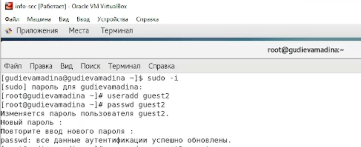
*Figure 1: Создание учетной записи пользователя guest2*

---

# Добавление пользователя guest2 в группу guest

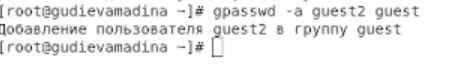

*Figure 2: Добавление пользователя guest2 в группу guest*

---

# Использование команды whoami, id и pwd

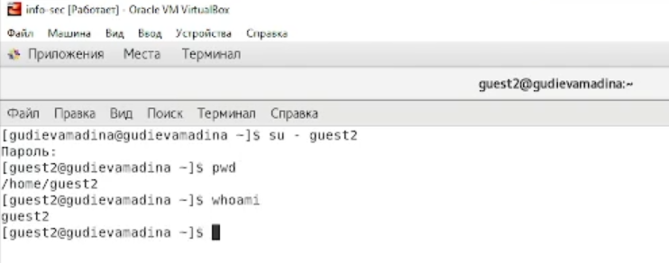
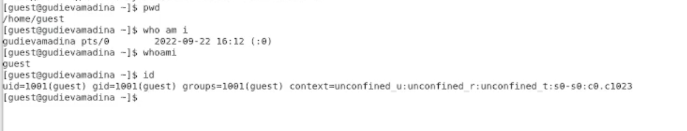

---

# Уточнение группы пользователя, и тех, кто также входит в эту группу
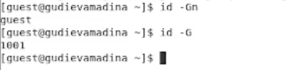
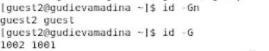
*Figure 5: Уточнение группы пользователя, и тех, кто также входит в эту группу*

---

### Просмотр файла ‘/etc/group’

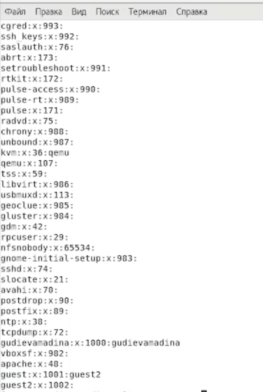

---

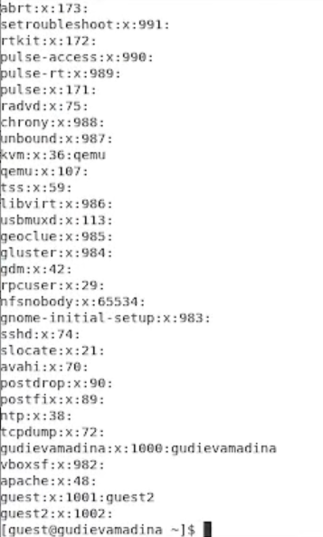
*Figure 6: Просмотр файла ‘/etc/group’*

---
# Регистрация пользователя guest2 в группе guest

*Figure 7: Регистрация пользователя guest2 в группе guest*

---
# Изменение прав директории ‘/home/guest’
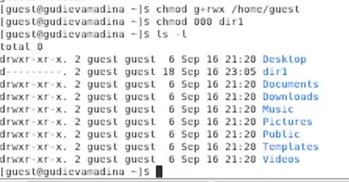

*Figure 8: Изменение прав директории ‘/home/guest’*

---

# Процесс заполнения таблицы
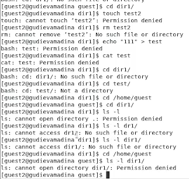

*Figure 9: Процесс заполнения таблицы*

---

# Таблица «Установленные права и разрешённые действия для групп»

---

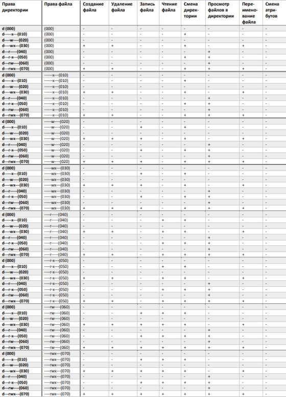

*Figure 10: Таблица «Установленные права и разрешённые действия для групп»*

---

# Таблица “Минимальные права для совершения операций от имени пользователей входящих в группу

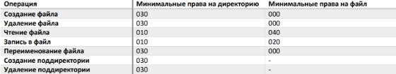

*Figure 11: Таблица “Минимальные права для совершения операций от имени пользователей входящих в группу”*

---

# Выводы

Таким образом я успешно приобрела практические навыки работы в консоли с атрибутами файлов для групп пользователей.