# Лабораторная работа №5
## Дискреционное разграничение прав в Linux. Исследование влияния дополнительных атрибутов

Гудиева Мадина Куйраевна

Содержание

---

**Цель работы**

Изучение механизмов изменения идентификаторов, применения SetUID- и Sticky-битов. Получение практических навыков работы в консоли с дополнительными атрибутами. Рассмотрение работы механизма смены идентификатора процессов пользователей, а также влияние бита Sticky на запись и удаление файлов.

---

**Цель работы**

Изучение механизмов изменения идентификаторов, применения SetUID- и Sticky-битов. Получение практических навыков работы в консоли с дополнительными атрибутами. Рассмотрение работы механизма смены идентификатора процессов пользователей, а также влияние бита Sticky на запись и удаление файлов.

---

**Выполнение лабораторной работы**

Вошла в систему от имени пользователя guest. Создала программу simpleid.c.
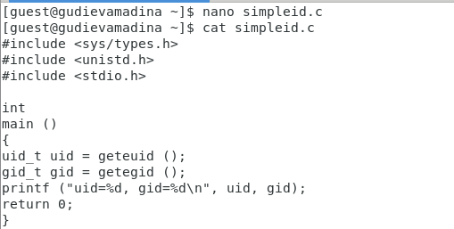

---

Скомпилировала и выполнила программу. Выполнив системную программу id убедилась в правильности выведенных данных

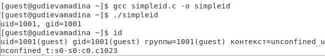

---

Усложнила программу, добавив вывод действительных идентификаторов, назвала её simpleid2.c 

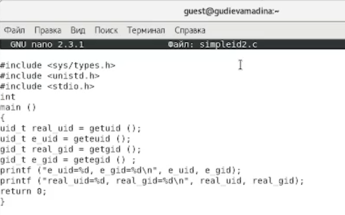 

---

Скомпилировала и запустила программу 

---

От имени суперпользователя установила новые атрибуты и сменила владельца файла simpleid2 

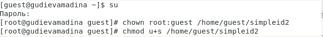

---

Выполнила проверку и запустила программу 
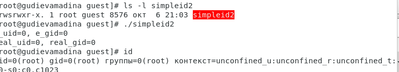

---

Проделала тоже самое относительно SetGID-бита

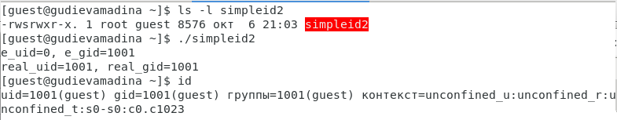

---

Создала программу readfile.c 

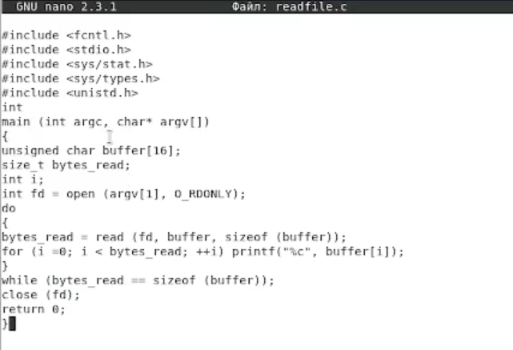

---

Откомпилировала её 

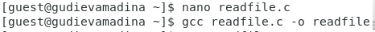

---

Сменила владельца у файла readfile.c и изменила права так, чтобы только суперпользователь (root) мог прочитать его, a guest не мог
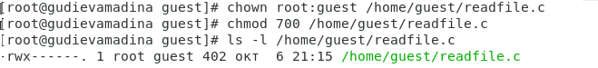

---

Убедилась, что guest не может прочитать файл readfile.c 

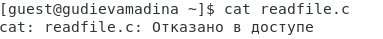
Смените у программы readfile владельца и установите SetU’D-бит 

---

Убедилась, что readfile может прочитать файлы readfile.c и "/etc/shadow" 

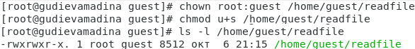

---

Убедилась, что атрибут Sticky установлен на директории "/tmp" 

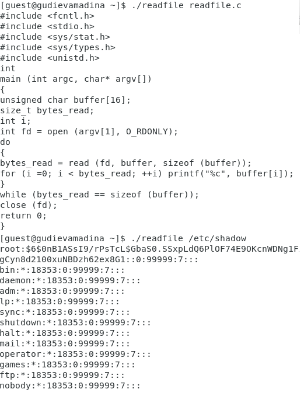

---

От имени пользователя guest создала файл file01.txt в директории "/tmp" со словом test. Разрешила чтение и запись для категории пользователей «все остальные» 
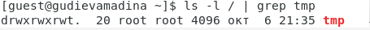

---

От пользователя guest2 просмотрела файл, успешно дозаписала и переписала его. Но не смогла его удалить 

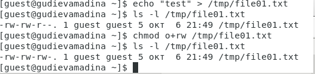

---

От суперпользователя сняла атрибут t (Sticky-бит) с директории "/tmp"

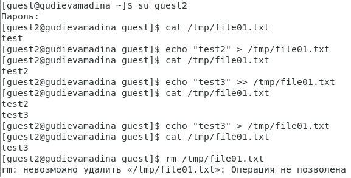

---

Убедилась в правильности снятия атрибута и повторила предыдущие шаги. В этот раз удаление также прошло успешно
От суперпользователя вернула атрибут t (Sticky-бит) на директорию "/tmp" 

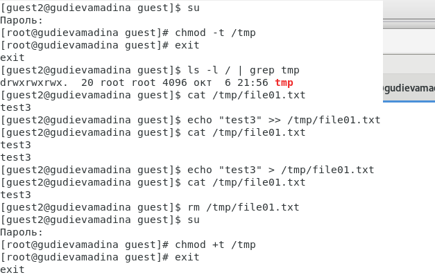

---

Выводы
Таким образом я успешно приобрела изучила механизмы изменения идентификаторов, применения SetUID- и Sticky-битов. Получила практические навыки работы в консоли с дополнительными атрибутами. Рассмотрела работу механизма смены идентификатора процессов пользователей, а также влияние бита Sticky на запись и удаление файлов.

---

Список литературы
Использование SETUID, SETGID и Sticky bit. // ruvds.com 2021. URL: https://ruvds.com/ru/helpcenter/suid-sgid-sticky-bit-linux/ (дата обращения 13.11.2021).

ИПрава в Linux (chown, chmod, SUID, GUID, sticky bit, ACL, umask). // habr.com 2019. URL: https://habr.com/ru/post/469667/ (дата обращения 13.11.2021).

Д. С. Кулябов, А. В. Королькова, М. Н. Геворкян. Информационная безопасность компьютерных сетей: лабораторные работы. // Факультет физико-математических и естественных наук. M.: РУДН, 2015. 64 с..