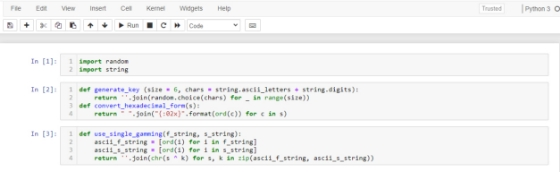
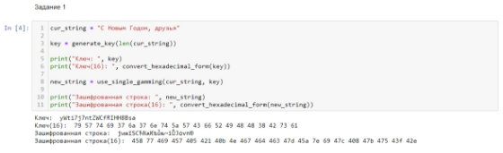

# Лабораторная работа №7**

## Элементы криптографии. Однократное гаммирование
### Гудиева Мадина Куйраевна

---

# Цель работы
Освоить на практике применение режима однократного гаммирования.

---

# Выполнение лабораторной работы
1. Для реализации приложения было принято решение воспользоваться jupyter notebook в котором я создала файл и на язке piton написала программный код.
1. Сначала я подключила необходимые библиотеки: random для использования рандомайзера при генерации ключей и string для использования констант. Затем я написала две функции. Первая - generate\_key - генерирует ключ той же длины, что и строка, которую нужно зашифровать, принимая на вход длину этой самой строки. Функция возвращает сгенерированный ключ в виде строки. Вторая - convert\_hexadecimal\_form - выполняет перевод в шестнадцатиричную систему строку, которую принимает на вход. Функция возвращает строку в шестнадцатиричном виде (fig. 1).

*Figure 1: Блок программы с библиотеками и функциями*

---

3. В первом пункте нужно было определить вид шифротекста при известном ключе и известном открытом тексте. Поэтому я ввела нужную строку. Сгенерировала для неё ключ. И вывела эту строку в зашифрованном виде. При этом дублировала выводы в шестнадцатиричном виде (fig. 2).

*Figure 2: Блок программы с выполнением первого пункта*

---

4. Во втором пункту нужно было определить ключ, с помощью которого шифротекст может быть преобразован в некоторый фрагмент текста, представляющий собой один из возможных вариантов прочтения открытого текста. Поэтому я сгенерировала новый ключ нужной длины и попыталась им дешифровать запись. Полученный результат вывела в исходном и шестнадцатеричном виде. Также я заново сгенерировала ключ, используя исходную и зашифрованную строки из первого пункта, и удачно расшифровала строку. (fig. 3).

*Figure 3: Блок программы с выполнением первого пункта*

---

# Выводы
Таким образом я успешно освоила на практике применение режима однократного гаммирования.
