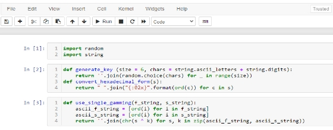
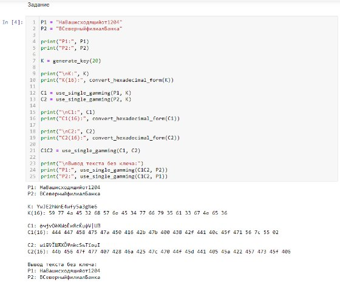

---
marp: true
---

Лабораторная работа №8

Элементы криптографии. Шифрование (кодирование) различных исходных текстов одним ключом
Гудиева Мадина Куйраевна

---

#Цель работы
Освоить на практике применение режима однократного гаммирования на примере кодирования различных исходных текстов одним ключом.

---

Выполнение лабораторной работы
1. Для реализации приложения было принято решение воспользоваться jupyter notebook в котором я создала файл и на язке piton написала программный код.

---

1. Сначала я подключила необходимые библиотеки: random для использования рандомайзера при генерации ключей и string для использования констант. Затем я написала две функции. Первая - generate\_key - генерирует ключ той же длины, что и строка, которую нужно зашифровать, принимая на вход длину этой самой строки. Функция возвращает сгенерированный ключ в виде строки. Вторая - convert\_hexadecimal\_form - выполняет перевод в шестнадцатиричную систему строку, которую принимает на вход. Функция возвращает строку в шестнадцатиричном виде (fig. 1).

*Figure 1: Блок программы с библиотеками и функциями*

---

3. В задании нужно было прочитать оба текста, не зная ключ и не стремясь его определить. Поэтому я ввела начальные данные, сгенерировала ключ и зашифровала их. После этого с помощью однократного гаммирования я сложила 2 шифротекста с одним из начальных и получила второй (fig. 2).

*Figure 2: Блок программы с выполнением задания*

---

Выводы
Таким образом я успешно освоила на практике применение режима однократного гаммирования на примере кодирования различных исходных текстов одним ключом.

---

