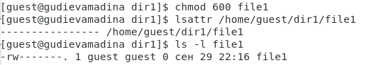
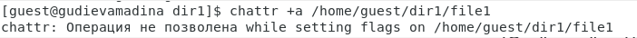
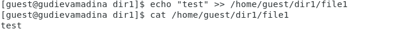
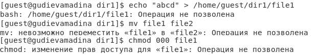
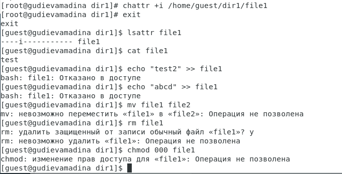

# Лабораторная работа №4
## Дискреционное разграничение прав в Linux. Расширенные атрибуты

Гудиева Мадина Куйраевна

Содержание

---

**Цель работы**

Получение практических навыков работы в консоли с расширенными атрибутами файлов.

---

**Выполнение лабораторной работы**

1. От имени пользователя guest определила расширенные атрибуты файла ‘/home/guest/dir1/file1’ (fig. 1).

*Figure 1: Расширенные атрибуты файла ‘/home/guest/dir1/file1’*

---

2. Установила на файл file1 права, разрешающие чтение и запись для владельца файла (fig. 2).

*Figure 2: Смена прав файла ‘/home/guest/dir1/file1’*

---

3. Попробовала установить на файл /home/guest/dir1/file1 расширенный атрибут ‘a’ от имени пользователя guest. Получила отказ от выполнения операции (fig. 3).

*Figure 3: Попытка смены расширенного атрибута файла ‘/home/guest/dir1/file1’*

---

4. Зашла на другую консоль с правами администратора. Попробовала установить расширенный атрибут ‘a’ на файл /home/guest/dir1/file1 от имени суперпользователя (fig. 4).

*Figure 4: Смена расширенного атрибута файла ‘/home/guest/dir1/file1’*

---

5. От пользователя guest проверила правильность установления атрибута (fig. 5).

*Figure 5: Проверка правильности смены расширенного атрибута файла ‘/home/guest/dir1/file1’*

---

6. Выполнила дозапись в файл file1 слова «test», убедилась, что слово ‘test’ было успешно записано (fig. 6).

*Figure 6: Дозапись слова ‘test’ в файл ‘/home/guest/dir1/file1’*

---

7. Попробовала удалить файл file1, стереть имеющуюся в нём информацию, переименовать, а также сменить права на файл. Получила отказ (fig. 7).

*Figure 7: Отказ на команды при расширенном атрибуте ‘a’*

---

8. Сняла расширенный атрибут ‘a’ с файла ‘/home/guest/dir1/file1’ и повторила проделанные ранее команды. Всё прошло успешно (fig. 8, fig. 9).

*Figure 8: Снятие расширенного атрибута ‘a’*

*Figure 9: Успешное повторное выполнение команд*

---

9. Установила расширенный атрибут ‘i’ на файл /home/guest/dir1/file1 от имени суперпользователя. Повторила проделанные ранее команды. В данном случае не удалось даже дозаписать в файл. Таким образом я получила отказ на выполнение всех команд (fig. 10, fig. 11).

*Figure 10: Установка расширенного атрибута ‘i’*

---

**Выводы**

Таким образом я успешно приобрела практические навыки работы в консоли с расширенными атрибутами файлов.

**Список литературы**

1. Атрибуты файлов в Linux. // ZaLinux.ru. 2021. URL: https://zalinux.ru/?p=6440 (дата обращения 30.10.2021).
1. Изменение атрибутов (флагов) на файлах в Unix/Linux. // linux-notes.com. 2015. URL: https://linux-notes.org/izmenenie-atributov-flagov-na-fajlah-v-unix-linux/ (дата обращения 30.10.2021).
1. Д. С. Кулябов, А. В. Королькова, М. Н. Геворкян. Информационная безопасность компьютерных сетей: лабораторные работы. // Факультет физико-математических и естественных наук. M.: РУДН, 2015. 64 с..
